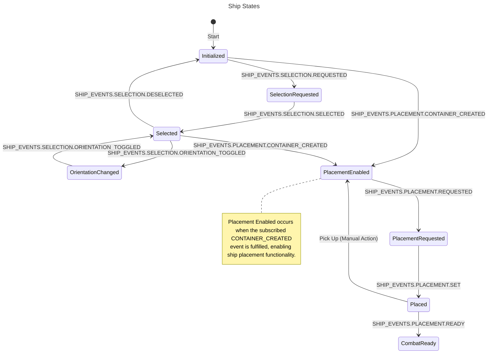

# Ship

## Overview

The Ship component is a central element of the game, managing the individual ships' states,
including their placement, orientation, selection, and combat status. This document outlines the
component's functionality, focusing on state transitions and event handling facilitated by the
ShipController.

